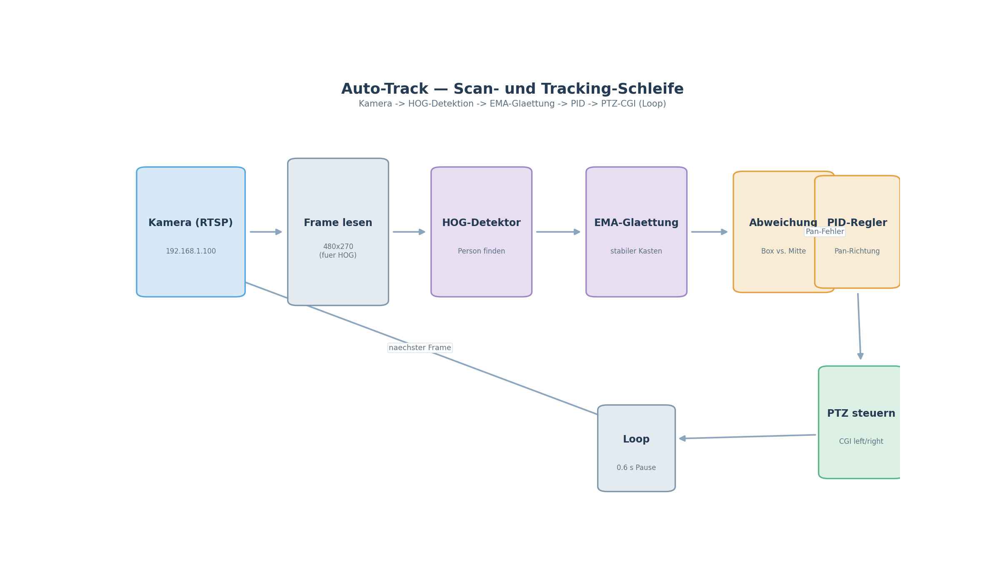

# UtutCam — Auto Track (Personenverfolgung mit PTZ-Kamera)

## 1. Überblick

Auto Track ist das Herzstück der UtutCam: Es erkennt eine Person im Kamerabild
in **Echtzeit** und steuert die Kamera so, dass die Person **immer mittig im
Bild** bleibt. Wird die Person gefunden, folgt die Kamera ihr; bewegt sie sich
nicht (Person mittig, im Deadzone-Bereich), **steht die Kamera vollkommen
still**.

Die Erkennung läuft auf dem **PC (lokal)** — das Bild kommt per RTSP vom
Kamera-Server, wird mit einem Neuronalen Netz (oder klassischem HOG-Detektor)
ausgewertet und die Kamerabewegung wird über das **PTZ-CGI-Protokoll** der
Hi3510-Kamera geschickt.



**Simulation:** [`auto_track_simulation.mp4`](simulationen/auto_track_simulation.mp4)
(~59 s, 20 FPS) zeigt die komplette Track-Schleife in der simulierten Welt —
Person erkennen, EMA-Glättung, Fehler zur Bildmitte und die PTZ-Nachführung.

## 2. Startbefehle

> **Wichtig:** Alle Skripte laufen vom Projektstamm `C:\Users\youss\Desktop\UtutCam` aus
> (wegen `sys.path.insert(0, ".")`).

### 2.1 Echte Kamera (Auto Scan + Track)

```powershell
cd C:\Users\youss\Desktop\UtutCam
C:\Users\youss\AppData\Local\Python\pythoncore-3.14-64\python.exe auto_track\auto_scan_track_cgi.py
```

**Tasten** (während das Bild sichtbar ist):

| Taste | Aktion |
|-------|--------|
| `S` | Scan-Modus (Kamera pendelt weit links/rechts) |
| `T` | Track-Modus (Kamera folgt der Person) |
| `2` / `4` | Person manuell links/rechts schieben (Diagnose) |
| `Q` / `Esc` | Programm beenden |

Beim Start ist der **Track-Modus aktiv** und die Kamera beginnt sofort zu
tracken (sobald eine Person erkannt wird).

### 2.2 Simulation (keine Kamera, nur Logik + Videoaufnahme)

```powershell
cd C:\Users\youss\Desktop\UtutCam
C:\Users\youss\AppData\Local\Python\pythoncore-3.14-64\python.exe auto_track\sim_ptz_test.py
```

Die Simulation zeichnet eine virtuelle Welt, eine **Person** (Strichmännchen)
und einen simulierten Kamerablick mit **Pan-Anzeige unten**. Sie demonstriert
exakt dieselbe Track-Logik wie im echten Betrieb — **ohne** die echte Kamera.

- **Video-Aufnahme:** Die Simulation zeichnet sich selbst als Video auf
  (`auto_track\sim_aufnahme.mp4`, ~50 s, 20 FPS) und beendet sich danach
  automatisch.
- **Tasten:** `S` = Scan, `T` = Track, `7`/`9` = Person nach links/rechts
  laufen lassen, `Q`/`Esc` = Beenden.

Das aufgezeichnete Video ist unter
[`simulationen/auto_track_simulation.mp4`](simulationen/auto_track_simulation.mp4)
zu finden.

## 3. Wie es funktioniert (Ablauf pro Frame)

1. **Frame holen:** `RTSPStream` liest in einem eigenen Thread die neuesten
   Frames und gibt den aktuellsten zurück (Blockierung wird vermieden).
2. **Person erkennen:** Der Detektor bewertet das Bild:
   - **HOG-Detektor** (Standard, „ganz normaler Detektor“): klassischer
     Histogram-of-Oriented-Gradients Detektor von OpenCV mit
     „DefaultPeopleDetector“. Läuft stabil bei ~20–30 FPS auf einer halben
     Auflösung (480×270). Ergebnis: 1 stabile Box.
   - Alternativen (per Quelltext umschaltbar): `JahongirHumanDetector`
     (YOLOv8-CrowdHuman auf Colab trainiert), `OpenVinoHumanDetector`
     (gleiches Modell als OpenVINO-IR für CPU-Beschleunigung).
3. **Kasten stabilisieren:** Beim HOG-Detektor wird die Box über eine
   **EMA-Glättung** geglättet — der Kasten **springt nicht mehr** und wird
   nicht ständig größer/kleiner (das Problem trat beim vorherigen
   DeepSort-Tracker auf).
4. **Mittelpunkt berechnen:** Aus der Box wird die X-Mitte bestimmt, der
   Abstand zur Bildmitte ergibt den **Fehler in Pixeln** (`error_px`).
5. **PTZ steuern (asynchron!):** Der `PtzWorker` läuft in einem **eigenen
   Thread** und sendet PTZ-Schritte im Hintergrund:
   - Fehler links vom Zentrum → Kamera nach links
   - Fehler rechts vom Zentrum → Kamera nach rechts
   - `|Fehler| ≤ DEADZONE_PX (60)` → **Kamera steht still** (kein Drift!)
   - Zwischen zwei CGI-Steps liegen **0.6 s** (die CGI-Requests der Kamera
     sind langsam; das Intervall schützt die Kamera vor Überlastung).

### Deadzone — die „stille Mitte"

Die Kamera soll **stillstehen**, wenn die Person mittig ist. Dafür gibt es die
`DEADZONE_PX = 60`. Solange sich die Person also innerhalb von ±60 Pixeln der
Bildmitte befindet, wird **kein einziger** PTZ-Schritt gesendet.

```
Person → Kamera → Fehler  |  Aktion
─────────────────────────────────────────────
 -180 px                  │  Kamera<>LINKS
  -30 px                  │  (DEADZONE) → STOPP
    0 px                  │  (DEADZONE) → STOPP
  +45 px                  │  (DEADZONE) → STOPP
 +160 px                  │  Kamera>RECHTS
```

## 4. Module & Modelle

### 4.1 Detektoren (in `auto_track/scanning.py`)

| Klasse | Modell | Beschreibung | FPS (lokal) |
|--------|--------|--------------|-------------|
| `HogHumanDetector` | OpenCV HOG `DefaultPeopleDetector` | klassisch, stabil, EMA-geglättet | ~20–30 |
| `JahongirHumanDetector` | `yolov8_human/weights/best.pt` | YOLOv8-CrowdHuman, **auf Google Colab trainiert**, PyTorch | ~8–15 |
| `OpenVinoHumanDetector` | `jahongir_ov/jahongir_fixed.xml` | dasselbe Modell als OpenVINO-IR (416 px), CPU | ~19 (incl. Tracker) |
| `PersonDetector` | `models/yolov8n_crowdhuman_best.pt` | Ultralytics-Wrapper (älter) | – |

### 4.2 PTZ-Steuerung

| Klasse | Protokoll | Zweck |
|--------|-----------|-------|
| `CgiPtzController` | Hi3510 CGI (`yt_left.cgi` / `yt_right.cgi` …) | Schrittsteuerung der echten Kamera (Standard) |
| `PTZController` | ONVIF (Velocity) | ältere/ONVIF-Kamera 192.168.178.43 |

### 4.3 Kamera

| Klasse | Zweck |
|--------|-------|
| `RTSPStream` | Thread-basierter RTSP-Leser der Kamera, hält den neuesten Frame |

## 5. Treibende Konstanten

Die wichtigsten Einstellungen stehen oben in `auto_track/auto_scan_track_cgi.py`:

| Konstante | Wert | Bedeutung |
|-----------|------|-----------|
| `DEADZONE_PX` | `60` | Mittiger Bereich in Pixeln, in dem die Kamera stillsteht |
| `STEP_MAX` | `6.0` | max. Schrittzahl je CGI-Befehl |
| `STEP_LO` | `2.0` | Mindestschritte |
| `ERR_LO` | `65` | Fehler, ab dem volle Schritte fahren |
| `ERR_HI` | `200` | Fehler, ab dem volle Schritte fahren |
| `MISS_TOLERANZ` | `12` | Frames ohne Person, bis keine Zielwahl mehr |
| `MISS_TRACK_TO_SCAN` | `14` | Frames ohne Person, bis in Scan gewechselt wird |
| `CONF` | `0.30` | Konfidenz-Schwelle des Detektors |

## 6. Informationen zu Google Colab

Das verwendete Personen-Modell (YOLOv8, CrowdHuman-Variante) wurde **auf
Google Colab trainiert**:

- **Colab-Notebooks:** unter `colab/` — `build_ututcam_notebook.py`
  (Webcam-Live-Detektion) und `build_ututcam_notebook_v2.py` (4-Fenster-System,
  lädt `UtutBest/UtutGun/UtutHand.pt` + `faces.json` + `fahndungen.json` vom
  GitHub-Release `v1` des Repos `NovaAixYoussef/ututcam-models`).
- Dort wurden Modell-Exporte (PyTorch → ONNX → OpenVINO) für die CPU-Ausführung
  vorbereitet. Der Export nach **OpenVINO-IR** wird lokal genutzt, um hohe
  Bildraten ohne GPU zu erreichen.

## 7. Häufige Probleme

| Symptom | Ursache / Lösung |
|---------|------------------|
| Kamera reagiert nicht mehr | **Zu viele CGI-Requests** → Kamera friert ein. Abwarten (2–5 min) oder Stromunterbrechung. Immer 0.6 s Schritt-Intervall lassen. |
| Video ruckelt | CGI-Steps blockierten die Schleife → seit `PtzWorker` (eigener Thread) behoben. |
| Kasten wird mal größer, mal kleiner | trat mit DeepSort auf → seit EMA-geglättetem **HOG-Detektor** behoben. |
| Person wird nicht getrackt | Konfidenz-Schwelle (`CONF`) prüfen, Person muss groß genug im Bild sein. |

## 8. Verwandte Dateien

- `auto_track/auto_scan_track_cgi.py` — Hauptskript Scan+Track
- `auto_track/scanning.py` — Detektoren, Kamera, PTZ-Controller
- `auto_track/sim_ptz_test.py` — Simulation + Videoaufnahme
- `auto_track/jahongir_ov/` — OpenVINO-IR des Personenmodells
- `auto_track/yolov8_human/` — trainiertes YOLOv8-Modell + Architektur
- `docs/bilder/gesichts_netzwerk.svg` — neuronale-Netz-Visualisierung
  (Gesichtserkennung)
- `docs/simulationen/` — Videoaufnahmen der Simulationen