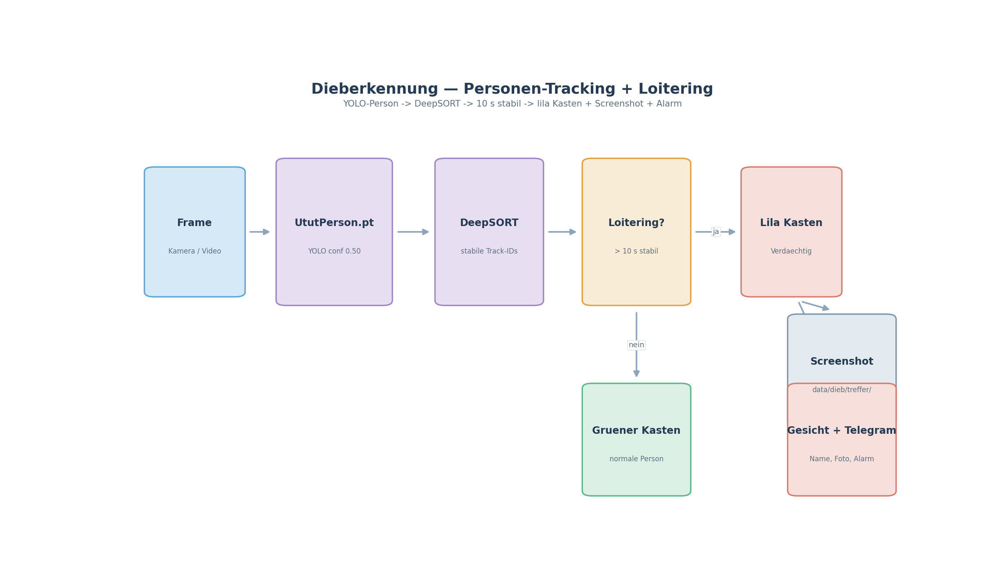

# UtutCam — Dieberkennung (Shoplifting / Ladendiebstahl)

## 1. Überblick

Die Dieberkennung beobachtet Personen im Video und schlägt Alarm, wenn jemand
**auffällig lange** an einem Ort bleibt oder ein **möglicher Diebstahl-Vorgang**
erkannt wird. Grundlage sind zwei Neurale Netze: ein **Personendetektor**
(UtutPerson.pt, Colab-trainiert) mit **DeepSORT-Tracking** und optional ein
**Posen-Modell** (yolov8n-pose), das typische Dieb-Bewegungen (Gegenstand
abdecken, Kasse anfassen) bewertet.

```
Personen im Video ──► YOLO (UtutPerson) + DeepSORT ──► Track pro Person
        │ loitering_threshold überschritten (10 s)
        ▼
   [Dieb verdächtig] ──► lila Kasten + Screenshot + optional Gesicht-Check + Telegram
```



**Simulation:** [`dieb_simulation.mp4`](simulationen/dieb_simulation.mp4)
(32 s) — echte Aufnahme aus `dieb_erkennung/output/`: eine Person, die lange an
einem Ort verweilt, wird über **Loitering** erkannt und als Verdächtiger
(Loitering-Kasten) markiert.

## 2. Startbefehle

> Alle Skripte laufen vom Projektstamm `C:\Users\youss\Desktop\UtutCam` aus.

### 2.1 über die Web-App

```powershell
cd C:\Users\youss\Desktop\UtutCam
C:\Users\youss\AppData\Local\Python\pythoncore-3.14-64\python.exe web_app\server.py
```

Browser: `http://localhost:5000` → Seite `Dieb_Erkennung`. Der
`DiebWorker`-Thread läuft dort automatisch.

### 2.2 Einzelmodul testen (Python-API)

```python
from dieb_erkennung.detector import ShopliftingDetector
det = ShopliftingDetector()            # Standard-Konfiguration
verdacht = det.detect_all(frame)       # verarbeitet einen Frame
```

## 3. Wie es funktioniert

### 3.1 `ShopliftingDetector` (`dieb_erkennung/detector.py`)

Kernklasse mit folgenden Schritten pro Frame:

1. **Personen erkennen:** `YOLO(UtutPerson.pt)` mit `conf=0.50`, `imgsz=640`.
   Nur Klasse 0 (`person`), gefiltert nach `min_box_area=3000` und
   `min_height_ratio=0.08`.
2. **Tracking:** `DeepSort(max_age=50)` vergibt stabile Track-IDs, damit jede
   Person einzeln verfolgt wird.
3. **Loitering-Erkennung:** Sind die x-Koordinaten einer Person länger als
   `loitering_threshold=10.0` Sekunden **stabil** (sie bleibt an einer Stelle),
   wird sie zum **Verdächtigen** → Kasten **lila (255,0,255)**.
4. **Optional beim Verdacht:**
   - **Gesicht prüfen:** Person in der Gesichtsdatenbank suchen
     (`face_erkennung`) → wenn bekannt, Name mitschicken (`_identify`).
   - **Screenshot:** Trefferbild nach `data/dieb/treffer/` speichern.
   - **Telegram-Alarm:** Foto + Name/Text per `TelegramNotifier`
     (Cooldown 60 s).

Normale Personen erhalten einen **grünen** Kasten, Verdächtige **lila**.

### 3.2 `theftguard.py` + `pose_detector.py`

- `TheftDetection` nutzt `yolov8n.pt` + `yolov8n-pose.pt` auf
  Diebstahl-Klassen (Gegenstände: `[24,25,26,28,39,40,41,42,43,67,73–79]`).
  Erkannte Objekte werden mit deutschen Namen angezeigt (`ITEM_NAMES_DE`).
- Die Verdachts-DB liegt unter `data/dieb/diebe.json`
  (`THIEF_MATCH_THRESHOLD=0.40`).

## 4. Konfiguration

| Parameter | Standard | Bedeutung |
|-----------|----------|-----------|
| `conf` | `0.50` | Person-Konfidenz |
| `loitering_threshold` | `10.0` s | Verweildauer bis Verdacht |
| `imgsz` | `640` | Modell-Eingabe |
| `min_box_area` | `3000` | zu kleine Boxen ignorieren |
| `min_height_ratio` | `0.08` | Personen müssen 8% der Bildhöhe sein |
| `face_check` | `True` | Gesicht bei Verdacht in DB suchen |
| `notify_cooldown` | `60.0` s | min. Abstand zwischen Telegram-Alarmen |

## 5. Modelle

- `waffen_erkennung/models/UtutPerson.pt` — Personen-Detektor (Colab)
- `dieb_erkennung/models/yolov8n.pt` — Objekt-Detektor (Gegenstände)
- `dieb_erkennung/models/yolov8n-pose.pt` — Pose-Modell (Bewegung)

## 6. Verwandte Dateien

- `dieb_erkennung/detector.py` — ShopliftingDetector (Hauptmodul)
- `dieb_erkennung/theftguard.py` — Gegenstands/Diebstahls-Erkennung
- `dieb_erkennung/pose_detector.py` — Pose-basierte Warnung
- `web_app/server.py` — DiebWorker im Web
- `data/dieb/` — Screenshots (`treffer/`) + Verdachts-DB