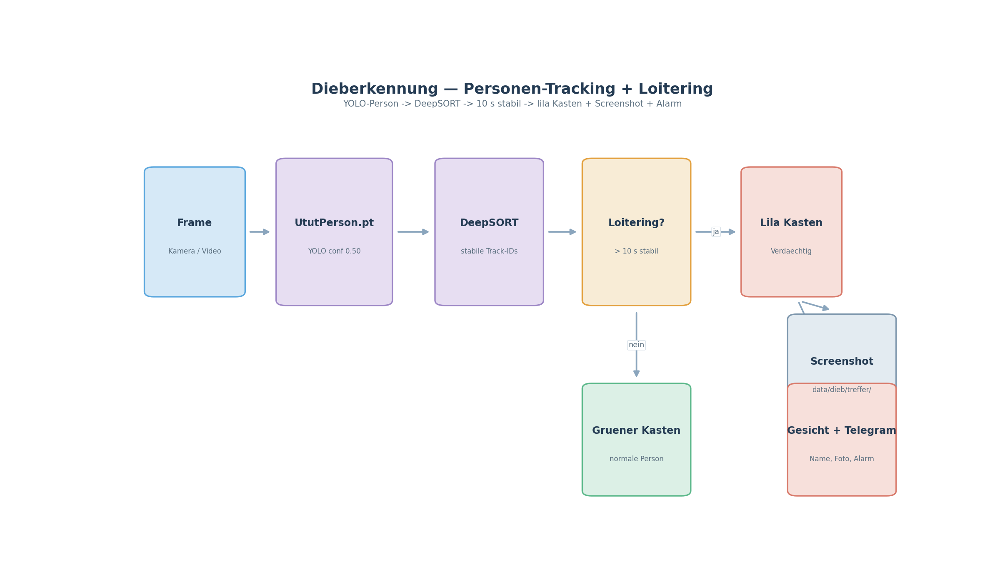

# :material-account-search: Dieberkennung (Shoplifting / Ladendiebstahl)

!!! ututcam "Überblick"
    Zwei neuronale Netze beobachten Personen: **UtutPerson + DeepSORT**
    (Tracking, Loitering ≥ 10 s) und ein **Posen-Modell** (COCO-17-Keypoints),
    das typische Dieb-Bewegungen wie „Gegenstand abdecken" bewertet. Bei
    Verdacht: lila Kasten, Screenshot + optional Telegram.

## 1. Überblick

Die Dieberkennung beobachtet Personen im Video und schlägt Alarm, wenn jemand
**auffällig lange** an einem Ort bleibt oder ein **möglicher Diebstahl-Vorgang**
erkannt wird. Grundlage sind zwei Neurale Netze: ein **Personendetektor**
(UtutPerson.pt, Colab-trainiert) mit **DeepSORT-Tracking** und optional ein
**Posen-Modell** (yolov8n-pose), das typische Dieb-Bewegungen (Gegenstand
abdecken, Kasse anfassen) bewertet.

```
Personen im Video ──► YOLO (UtutPerson) + DeepSORT ──► Track pro Person
        │ loitering_threshold überschritten (10 s)
        ▼
   [Dieb verdächtig] ──► lila Kasten + Screenshot + optional Gesicht-Check + Telegram
```



**Simulation:** [`dieb_simulation.mp4`](simulationen/dieb_simulation.mp4)
(32 s) — **mit dem echten Pose-Code** erzeugt: `pose_detector.py` (COCO-17-
Keypoints + Loitering + Gesten) verarbeitet die vorhandene Aufnahme
`dieb_erkennung/output/vid_dieb_guard.mp4` (kein Neues Video, keine Fake-
Animation). Zu sehen: grüne/rote **Bounding-Boxen**, das Keypoints-Skelett
nur beim Verdacht und das rote **SHOPLIFTING-ERKANNT-Banner** bei echten
Verdachts-Erkennungen (Protokoll: `simulationen/dieb_simulation_result.json`).

<div class="sim-player">
  <video controls preload="metadata" muted>
    <source src="simulationen/dieb_simulation.mp4" type="video/mp4">
    Ihr Browser unterstützt kein eingebettetes Video.
  </video>
</div>

## 2. :material-terminal: Startbefehle

> Alle Skripte laufen vom Projektstamm `C:\Users\youss\Desktop\UtutCam` aus.

### 2.1 über die Web-App

```powershell
cd C:\Users\youss\Desktop\UtutCam
C:\Users\youss\AppData\Local\Python\pythoncore-3.14-64\python.exe web_app\server.py
```

Browser: `http://localhost:5000` → Seite `Dieb_Erkennung`. Der
`DiebWorker`-Thread läuft dort automatisch.

### 2.2 Einzelmodul auf der Webcam starten

```powershell
cd C:\Users\youss\Desktop\UtutCam

# 1) Loitering-Erkennung (UtutPerson + DeepSORT): grün → lila bei Verdacht
C:\Users\youss\AppData\Local\Python\pythoncore-3.14-64\python.exe dieb_erkennung\detector.py --webcam

# 2) Volle Erkennung mit Keypoints (COCO-17-Skelett + Loitering + Geste):
C:\Users\youss\AppData\Local\Python\pythoncore-3.14-64\python.exe dieb_erkennung\pose_detector.py --webcam

# 3) TheftGuard (Diebstahl-Klassen + Abgleich gegen die Dieb-DB):
C:\Users\youss\AppData\Local\Python\pythoncore-3.14-64\python.exe dieb_erkennung\theftguard.py --webcam

# Nur die Dieb-Erkennung (ohne Gesichtsabgleich):
C:\Users\youss\AppData\Local\Python\pythoncore-3.14-64\python.exe dieb_erkennung\pose_detector.py --webcam --no-face

# 4) Komplett-Live-Skript — ALLE Funktionen zusammen (4 Fenster: Pistole | Messer | Gesicht+Fahndung | Dieb+Keypoints):
C:\Users\youss\AppData\Local\Python\pythoncore-3.14-64\python.exe messer_erkennung\live_all.py
```

Befehle1–3 starten **jeweils nur** die Dieb-Erkennung in einem eigenen Fenster.
Jeweiliges `q` beendet das Fenster. Optional `--telegram` für
Benachrichtigungen, `--no-face` schaltet den Gesichtsabgleich aus.

### 2.3 Einzelmodul testen (Python-API)

```python
from dieb_erkennung.detector import ShopliftingDetector
det = ShopliftingDetector()            # Standard-Konfiguration
verdacht = det.detect_all(frame)       # verarbeitet einen Frame
```

### 2.4 Video verarbeiten

```powershell
C:\Users\youss\AppData\Local\Python\pythoncore-3.14-64\python.exe dieb_erkennung\detector.py dieb_erkennung\output\vid_dieb_guard.mp4
C:\Users\youss\AppData\Local\Python\pythoncore-3.14-64\python.exe dieb_erkennung\pose_detector.py dieb_erkennung\output\vid_dieb_guard.mp4
```

Das Ergebnis liegt in `dieb_erkennung/output/` (`*_dieb.mp4` bzw.
`*_pose_dieb.mp4`).

## 3. :material-cog: Wie es funktioniert

### 3.1 `ShopliftingDetector` (`dieb_erkennung/detector.py`)

Kernklasse mit folgenden Schritten pro Frame:

1. **Personen erkennen:** `YOLO(UtutPerson.pt)` mit `conf=0.50`, `imgsz=640`.
   Nur Klasse 0 (`person`), gefiltert nach `min_box_area=3000` und
   `min_height_ratio=0.08`.
2. **Tracking:** `DeepSort(max_age=50)` vergibt stabile Track-IDs, damit jede
   Person einzeln verfolgt wird.
3. **Loitering-Erkennung:** Sind die x-Koordinaten einer Person länger als
   `loitering_threshold=10.0` Sekunden **stabil** (sie bleibt an einer Stelle),
   wird sie zum **Verdächtigen** → Kasten **lila (255,0,255)**.
4. **Optional beim Verdacht:**
   - **Gesicht prüfen:** Person in der Gesichtsdatenbank suchen
     (`face_erkennung`) → wenn bekannt, Name mitschicken (`_identify`).
   - **Screenshot:** Trefferbild nach `data/dieb/treffer/` speichern.
   - **Telegram-Alarm:** Foto + Name/Text per `TelegramNotifier`
     (Cooldown 60 s).

Normale Personen erhalten einen **grünen** Kasten, Verdächtige **lila**.

### 3.2 `theftguard.py` + `pose_detector.py`

- `TheftDetection` nutzt `yolov8n.pt` + `yolov8n-pose.pt` auf
  Diebstahl-Klassen (Gegenstände: `[24,25,26,28,39,40,41,42,43,67,73–79]`).
  Erkannte Objekte werden mit deutschen Namen angezeigt (`ITEM_NAMES_DE`).
- Die Verdachts-DB liegt unter `data/dieb/diebe.json`
  (`THIEF_MATCH_THRESHOLD=0.40`).

### 3.3 Posen-/Bewegungs-Bewertung (COCO-17-Keypoints)

Das **Posen-Modell** (`yolov8n-pose`) zeichnet pro Person ein Skelett aus
**17 Keypoints** — Nase, Augen, Ohren, Schultern, Ellbogen, Handgelenke,
Hüften, Knie und Füße:


Aus diesen 17 Punkten wird eine **Geste** abgeleitet (`_gesture_score` in
`dieb_erkennung/pose_detector.py`):

- **Kopf gesenkt** (Nase unterhalb der Schulterlinie) → +1
- **Hände unterhalb der Hüftlinie** (je Handgelenk) → +1 je Hand

Erreicht eine Person genügend Gesture-Frames über ein Zeitfenster
(`gesture_frames_threshold=12`), wird sie wie beim Loitering als **Dieb**
eingestuft — typische Ladebewegung „Gegenstand abdecken / in die Hosentasche
stecken". Das Skelett wird live als lila (Verdacht) bzw. grüner Linienzug im
Video gezeichnet (`_draw_pose`).

## 4. Konfiguration

| Parameter | Standard | Bedeutung |
|-----------|----------|-----------|
| `conf` | `0.50` | Person-Konfidenz |
| `loitering_threshold` | `10.0` s | Verweildauer bis Verdacht |
| `gesture_frames_threshold` | `12` | Gesture-Frames (Pose) bis Verdacht |
| `imgsz` | `640` | Modell-Eingabe |
| `min_box_area` | `3000` | zu kleine Boxen ignorieren |
| `min_height_ratio` | `0.08` | Personen müssen 8% der Bildhöhe sein |
| `face_check` | `True` | Gesicht bei Verdacht in DB suchen |
| `notify_cooldown` | `60.0` s | min. Abstand zwischen Telegram-Alarmen |

## 5. Modelle

- `waffen_erkennung/models/UtutPerson.pt` — Personen-Detektor (Colab)
- `dieb_erkennung/models/yolov8n.pt` — Objekt-Detektor (Gegenstände)
- `dieb_erkennung/models/yolov8n-pose.pt` — Pose-Modell (Bewegung)

## 6. :material-folder-open: Verwandte Dateien

- `dieb_erkennung/detector.py` — ShopliftingDetector (Hauptmodul)
- `dieb_erkennung/theftguard.py` — Gegenstands/Diebstahls-Erkennung
- `dieb_erkennung/pose_detector.py` — Pose-basierte Warnung
- `web_app/server.py` — DiebWorker im Web
- `data/dieb/` — Screenshots (`treffer/`) + Verdachts-DB