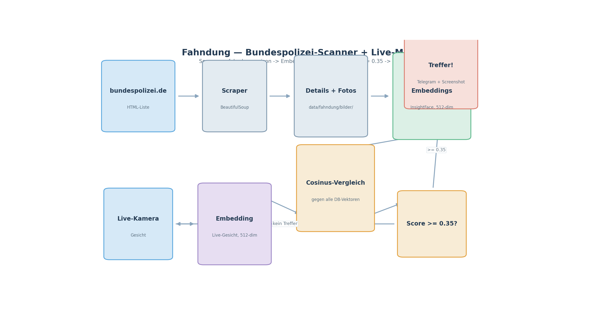

# UtutCam — Fahndung (Bundespolizei-Scanner + Live-Match)

## 1. Überblick

Das Fahndungsmodul lädt automatisch **aktuelle Fahndungslisten der
Bundespolizei** (`bundespolizei.de/aktuelles/fahndungen`), berechnet daraus
Gesichts-Embeddings (InsightFace buffalo_l, 512-dim) und gleicht **live** jedes
Kamerabild gegen diese Liste ab. Sobald ein Gesicht einem Fahndungsfoto
entspricht (Score ≥ 0.35), wird **die Person geerdet (+ Screenshot + Telegram)**.

```
bundespolizei.de ──► Scraper ──► fahndungen.json ──► Embeddings (512)
      ▲                                              │
Live-Kamera ──► Gesicht (buffalo_l) ──► Cosinus-Vergleich ──► Treffer?
                                                                │
                                                          Telegram + Screenshot
```



**Simulation:** [`fahndung_simulation.mp4`](simulationen/fahndung_simulation.mp4)
(~9 s) — **echter Live-Match** gegen die vorhandene `fahndungen.json`: Das
Kameragesicht wird mit InsightFace embeddingiert und gegen alle
Fahndungs-Vektoren verglichen, bis der Treffer (Score ≥ 0.35) angezeigt wird.

## 2. Startbefehle

> Alle Skripte laufen vom Projektstamm `C:\Users\youss\Desktop\UtutCam` aus.

### 2.1 Web-App (Fahndung-Seite + Live-Match)

```powershell
cd C:\Users\youss\Desktop\UtutCam
C:\Users\youss\AppData\Local\Python\pythoncore-3.14-64\python.exe web_app\server.py
```

Browser: `http://localhost:5000` → Seite `Fahndung`. Der `FahndungWorker`
läuft im Hintergrund.

### 2.2 Daten manuell aktualisieren

```powershell
C:\Users\youss\AppData\Local\Python\pythoncore-3.14-64\python.exe -c "from fahndung import fahndung_downloader as f; f.refresh_fahndungen()"
```

> Internetverbindung erforderlich (bundespolizei.de).

### 2.3 Selbsttest

```python
python -c "from messer_erkennung.UtutCam import run_fahndung_test; run_fahndung_test()"
```

## 3. Wie es funktioniert

Die Kernfunktionen liegen in `fahndung/fahndung_downloader.py`:

| Funktion | Beschreibung |
|----------|--------------|
| `fetch_listing(page=1)` | holt die Übersichtsliste der Fahndungen (mit Paginierung) |
| `fetch_detail(url)` | lädt eine Einzelfahndungsseite (Name, Foto-URL, Beschreibung) |
| `ensure_dirs()` | legt `data/fahndung/` und `data/fahndung/bilder/` an |
| `get_app()` | InsightFace buffalo_l (512-dim) |
| `news → DB` | speichert `fahndungen.json` inkl. pfad der Fotos |
| `recognize_fahndung(embedding, db, threshold=0.35)` | gleicht ein Live-Gesicht gegen alle Fahndungs-Embeddings ab |

Ablauf:

1. **Scrapen:** `BeautifulSoup` parst die HTML-Liste, extrahiert alle Links
   mit `fahndungen/` im Pfad sowie den Titel.
2. **Details laden:** Pro Eintrag wird die Detail-Seite geholt (Name,
   Beschreibung, Foto-URL).
3. **Fotos runterladen** nach `data/fahndung/bilder/`.
4. **Embeddings erzeugen:** jedes Foto → Gesicht → 512-dim Vektor.
5. **Live-Match:** Jedes Kamera-Gesicht wird mit jedem DB-Vektor per
   Cosinus-Ähnlichkeit verglichen. Treffer ≥ `MATCH_THRESHOLD (0.35)` → Alarm.

## 4. Datenstruktur

```
data/fahndung/
├── fahndungen.json    # Metadaten + 512-dim Embeddings aller Fahndungen
└── bilder/            # heruntergeladene Fahndungsfotos
```

`data/fahndung/generate_galerie.py` erstellt aus den Daten eine
**statische HTML-Galerie** (`fahndungen_galerie.html`) zur Vorschau.

## 5. Einstellungen

| Konstante | Wert | Bedeutung |
|-----------|------|-----------|
| `BASE_URL` | `https://bundespolizei.de` | Quelle |
| `LIST_URL` | `…/aktuelles/fahndungen` | Listen-Seite |
| `MATCH_THRESHOLD` | `0.35` | Treffer-Schwelle (streng, damit Alarm ausgelöst wird) |
| `EMB_DIM` | `512` | Embedding-Dimension |
| `USER_AGENT` | Browser-Chrome-UA | für scraper-freundliche Requests |

## 6. Integrierte Nutzung

- `web_app/server.py` → `FahndungWorker` (Thread)
- `messer_erkennung/UtutCam.py` → Live-Pipeline prüft jedes Gesicht gegen die
  Fahndung (`_fahndung_caption`)
- `relay/relay_client.py` → Alarm per Telegram
- Tests: `tests/test_fahndung.py` (Parsing, DB-Roundtrip, Matching)

## 7. Verwandte Dateien

- `fahndung/fahndung_downloader.py` — Scraper + Embedding + Match
- `data/fahndung/` — DB + Bilder
- `web_app/server.py` — Web-Integration
- `tests/test_fahndung.py` — Tests
- `docs/gesichtserkennung.md` — gleiches Embedding-System, andere Schwelle