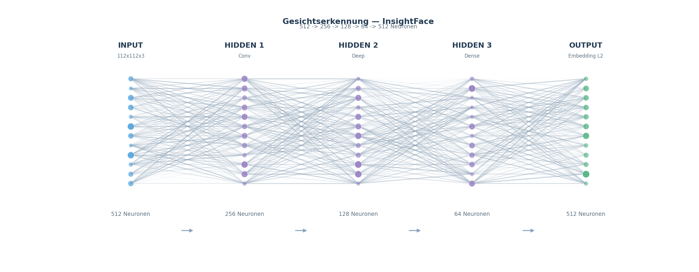

# UtutCam — Gesichtserkennung (InsightFace / Colab)

## 1. Überblick

Die Gesichtserkennung identifiziert Personen im Kamerabild anhand ihres
Gesichts. Dafür wird ein **Neuronales Netz** verwendet (InsightFace
`buffalo_l`), das jedes Gesicht auf einen **512-dimensionalen Zahlenvektor**
(Embedding) abbildet. Gleiche Personen haben ähnliche Vektoren; über einen
**Kosinus-Vergleich** mit der Gesichtsdatenbank wird der Name ermittelt.

```
Kamera-Gesicht ──► Neuronales Netz ──► Embedding (512) ──► Cosinus-Vergleich ──► "Anna" / "Unbekannt"
                                                              │
                                                        faces.json
```

**Simulation:** [`gesicht_simulation.mp4`](simulationen/gesicht_simulation.mp4)
(~13 s) — läuft mit **echtem InsightFace** auf einem echten Foto: Gesicht wird
erkannt, zum 512-dim Embedding gemacht und per Cosinus gegen die Datenbank
verglichen — bis zum Ergebnis „Erkannt / Unbekannt".

## 2. Die neuronale Netzwerk-Visualisierung

Das Herzstück — ein Neuronales Netz von der Pixel-Schicht bis zum Matching —
wird in folgendem Diagramm gezeigt. Du siehst die **Input-Schicht**, mehrere
**Hidden Layers**, die **Embedding-Schicht (512 Neuronen)** und den
**Cosinus-Vergleich** als Ausgang.



*(Quell-Grafik als SVG: [gesichts_netzwerk.svg](bilder/gesichts_netzwerk.svg) —
Plus einfaches MLP-Beispiel: [mlp_beispiel.png](bilder/mlp_beispiel.png).)*

**Die Grafik wird automatisch erzeugt** — aus einer einfachen Layer-Definition
per generischem Visualisierer (siehe unten). Jeder Kreis ist ein **Neuron**,
jede Linie eine **Gewichts-Verbindung** der Stärke nach **Liniendicke**; die
Neuronengröße zeigt optional die **Aktivierung**.

**Kurz erklärt:**

1. **INPUT** — Gesichts-Crop (112×112×3, RGB) aus dem Kamerabild.
2. **HIDDEN 1 (Conv-Features)** — Faltungsschicht, lernt Kanten und Konturen.
3. **HIDDEN 2 (Deep Features)** — tiefe Netz-Blöcke, filtern Gesichtsmerkmale
   (Augen, Nase, Mund, Struktur).
4. **HIDDEN 3 (Dense)** — dichte Schicht, fasst alle Merkmale zusammen.
5. **EMBEDDING (512)** — das Gesicht wird auf einen 512-dimensionalen Vektor
   reduziert, der **L2-normalisiert** wird (Länge = 1).
6. **COSINE-VERGLEICH (Output)** — das Embedding der Kamera wird mit jedem
   Embedding in der Datenbank verglichen. Der Kosinus-Score beantwortet:
   „Wie ähnlich?“ Score ≥ 0.40 → **Person erkannt**, sonst „Unbekannt“.

## 3. Startbefehle

> Alle Skripte laufen vom Projektstamm `C:\Users\youss\Desktop\UtutCam` aus.

### 3.1 Proxy-App „Person hinzufügen“ (Webcam)

```powershell
cd C:\Users\youss\Desktop\UtutCam
C:\Users\youss\AppData\Local\Python\pythoncore-3.14-64\python.exe apps\face_recognition_app.py

# Nur eine Person ohne Live-Fenster hinzufügen:
C:\Users\youss\AppData\Local\Python\pythoncore-3.14-64\python.exe apps\face_recognition_app.py --add "Max Mustermann"

# Ohne Anzeige-Window starten:
C:\Users\youss\AppData\Local\Python\pythoncore-3.14-64\python.exe apps\face_recognition_app.py --add-only
```

`q` beendet das Live-Fenster.

### 3.2 Face Manager (Datenbank verwalten, Thumbnail-Raster)

```powershell
C:\Users\youss\AppData\Local\Python\pythoncore-3.14-64\python.exe apps\face_manager_app.py
```

Personen hinzufügen/löschen über das Tkinter-Raster.

### 3.3 Gesichtserkennung im Web (via Web-App)

```powershell
C:\Users\youss\AppData\Local\Python\pythoncore-3.14-64\python.exe web_app\server.py
```

Dann im Browser `http://localhost:5000` → Seite `Gesicht_erkennung` (Serverlog
zeigt den Port). Der `GesichtWorker` läuft dauerhaft im Hintergrund und meldet
Treffer.

## 4. Wie es funktioniert

### 4.1 Embedding erzeugen (Kern-Funktion)

Die Datei `face_erkennung/face_database.py` stellt die komplette API bereit:

```python
from face_erkennung.face_database import get_app, add_person, recognize_face, load_db

app  = get_app()                     # InsightFace buffalo_l laden (CPU)
faces = app.get(img)                 # Gesichter im Bild erkennen
emb   = faces[0].normed_embedding    # 512-dim Embedding
```

| Funktion | Beschreibung |
|----------|--------------|
| `get_app()` | Lädt das InsightFace-Modell `buffalo_l` (CPU, det_size 640×640) |
| `add_person(name, image_path, tolerance=0.4)` | Erkennt Gesicht unter, prüft auf Duplikate und speichert Embedding in DB |
| `recognize_face(embedding, db, threshold=0.4)` | Misst die höchste Kosinus-Ähnlichkeit gegen alle DB-Einträge |
| `load_db()` / `save_db(db)` | Gesichtsdatenbank `data/face_db/faces.json` |
| `list_persons()` | Zeigt alle Namen mit Anzahl der Embeddings |

**Datenbank:** `data/face_db/faces.json` speichert pro Person eine Liste von
Embeddings (Referenz-Messungen) + Bildpfad.

### 4.2 Matchen (Cosinus)

```python
score = np.dot(embedding, db_embedding)   # Kosinus-Ähnlichkeit (L2-normiert)
if score >= MATCH_THRESHOLD (0.40): name = "Anna"
else: name = None  # "Unbekannt"
```

Gleiche Person (gleiches Gesicht) erzeugt fast das gleiche Embedding
(Score ≈ 0.6–0.9). Andere Personen liegen meist weit unter 0.4.

### 4.3 Schwellenwerte

| Konstante | Wert | wo |
|-----------|------|----|
| `MATCH_THRESHOLD` | `0.40` | Gesichtserkennung (Datenbank) |
| `MATCH_THRESHOLD` | `0.35` | Fahndung (strenger → lieber Alarm) |
| `EMB_DIM` | `512` | Dimension eines Embeddings |

## 5. Ausbildung / Google Colab

Die Gesichts-Embeddings werden **auf Google Colab** mit InsightFace-Modellen
vorberechnet:

- **Colab-Notebooks:** unter `colab/` (`build_ututcam_notebook.py`,
  `build_ututcam_notebook_v2.py`) — trainieren bzw. verwenden die
  `Utut*`-Modelle und erzeugen die Datenbanken/Embeddings.
- Der **Buffalo-L-Backbone** (SCRFD + ResNet) wird von InsightFace als
  vorab-trainiertes Modell bereitgestellt und über
  `face_erkennung`/`fahndung` lokal geladen.
- Auf Colab wurden große Bildlisten (z.B. Fahndungs-Galerie) verarbeitet und
  die 512-dim Embeddings gespeichert — lokal läuft dann nur noch der schnelle
  Vergleich.

## 6. Integrierte Nutzung

Die Gesichtserkennung ist in mehreren Modulen eingebaut:

| Modul | Was es mit Gesichtern macht |
|-------|------------------------------|
| `dieb_erkennung/detector.py` | Bei Dieb-Verdacht Gesicht des Verdächtigen in der DB suchen + Name melden |
| `fahndung/fahndung_downloader.py` | Fahndungsfotos → Embeddings → Live-Match (Schwelle 0.35) |
| `web_app/server.py` | `GesichtWorker` (Thread) + Face-Manager-Seite im Browser |
| `messer_erkennung/UtutCam.py` | Live-Pipeline prüft Gesicht (FACE_EVERY=6 Frames) + Fahndung |
| `relay/relay_client.py` | Melden erkannte Person/Fahndung per Telegram |

## 7. FAQ

| Frage | Antwort |
|-------|---------|
| Wo liegen die gespeicherten Personen? | `data/face_db/faces.json` (+ Fotos in `data/face_db/photos`) |
| Wie genau ist die Erkennung? | Sehr gut bei frontalem Licht; Brillen/Schatten senken den Score |
| Warum 512 Zahlen? | Kompakt + schnell vergleichbar; Standard von InsightFace |
| Läuft alles offline? | Ja, Modell & DB sind lokal; nur die Fahndung holt neue Daten vom Web |

## 8. Verwandte Dateien

- `face_erkennung/face_database.py` — Kern-API (Embedding, Matchen, DB)
- `apps/face_recognition_app.py` — Webcam-Hinzufügen
- `apps/face_manager_app.py` — Datenbank-Verwaltung
- `data/face_db/faces.json` — Gesichtsdatenbank
- `docs/bilder/gesichts_netzwerk.svg/.png` — Netzwerk-Visualisierung