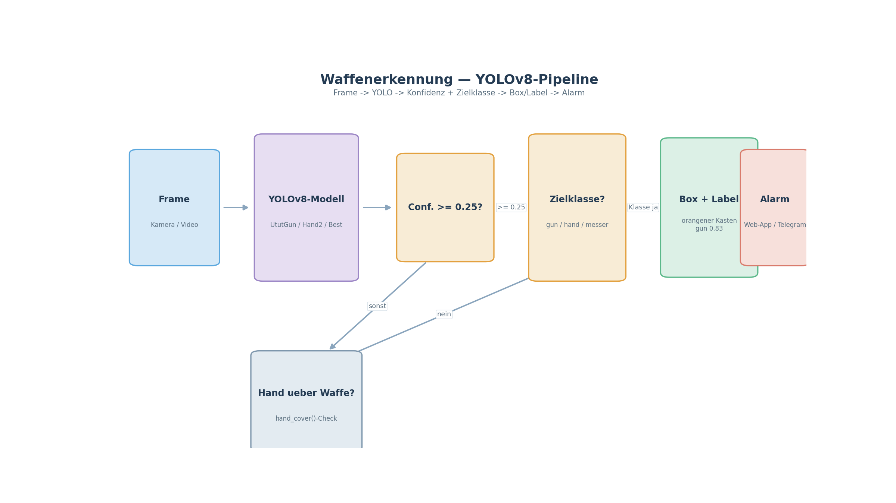

# UtutCam — Waffenerkennung (Gun / Hand / Messer)

## 1. Überblick

Die Waffenerkennung erkennt **Schusswaffen (gun)**, **Hände (hand)** und
**Messer** live im Video — mithilfe eines **YOLOv8-Neuronalen Netzes**, das auf
Google Colab mit eigenen Daten trainiert wurde. Pro erkanntem Objekt liefert
die Erkennung eine Bounding-Box, eine Konfidenz und die Klasse.

```
Kamera/Video ──► YOLOv8 (UtutGun/UtutBest) ──► Box + Konfidenz ──► orangener Kasten + Label
```



**Simulation:** [`waffen_simulation.mp4`](simulationen/waffen_simulation.mp4)
(26 s) — echte Aufnahme einer **Gun-Erkennung** aus `data/results/`: Personen
mit gezogener Waffe werden live als orangener Kasten mit Konfidenz-Label
markiert.

## 2. Startbefehle

> Alle Skripte laufen vom Projektstamm `C:\Users\youss\Desktop\UtutCam` aus.

### 2.1 Live-Demo mit 3 Fenstern (Webcam + Waffen + Gesichter)

```powershell
cd C:\Users\youss\Desktop\UtutCam
C:\Users\youss\AppData\Local\Python\pythoncore-3.14-64\python.exe messer_erkennung\live_3fenster.py
```

Öffnet 3 Fenster: Live-Video, Waffen-Erkennung, Gesichtserkennung. `Esc`
beendet.

### 2.2 Web-App (Ganzes Dashboard)

```powershell
C:\Users\youss\AppData\Local\Python\pythoncore-3.14-64\python.exe web_app\server.py
```

Im Browser `http://localhost:5000` → Seite `Waffen_erkennung`.

### 2.3 Haupt-Dashboard

```powershell
C:\Users\youss\AppData\Local\Python\pythoncore-3.14-64\python.exe main.py
```

## 3. Wie es funktioniert

Die Kernklassen liegen in `waffen_erkennung/detector.py` und nutzen alle
Ultralytics-YOLOv8-Modelle (`.pt`):

| Klasse | Modell | Erkennt |
|--------|--------|---------|
| `GunDetector` | `UtutGun.pt` | Schusswaffen (Klasse `gun`) |
| `HandDetector` | `UtutHand2.pt` | Hände (Klasse `hand`) |
| `WeaponDetector` | kombiniert Gun+Hand | Waffen mit Handbewegung/präzise |
| `KnifeDetector` | `UtutBest.pt` | Messer, Waffen, Hände (gemischt) |

Ablauf pro Frame:

1. Frame an `self.model(frame, stream=True, verbose=False, conf=0.25,
   imgsz=640)` geben.
2. YOLO liefert eine Liste mit Boxen; nur die Zielklasse (`gun` bzw. `hand`)
   wird behalten.
3. Konfidenz wird auf ganze Prozent gerundet (`conf*100//1 // 100`).
4. Treffer werden als orangener (0,165,255) Kasten mit Label `gun 0.83`
   gezeichnet (`GunDetector.draw()`).

Zusätzlich gibt es eine **Hand-über-Waffe-Abdeckung**:
`messer_erkennung/test_video_hand.py` testet mit `hand_cover(gun_box,
hand_box)`, ob eine Hand das Waffen-Objekt verdeckt — das reduziert Fehlalarme
durch bloße Hände.

## 4. Modelle (Colab-trainiert)

Die Modelle liegen in `waffen_erkennung/models/`:

| Datei | Verwendet von | Beschreibung |
|-------|---------------|--------------|
| `UtutGun.pt` | GunDetector | nur Schusswaffen |
| `UtutHand.pt` / `UtutHand2.pt` | HandDetector | nur Hände |
| `UtutBest.pt` | KnifeDetector / Weaponset | Multi-Klassen (Waffen+Hände+Messer) |
| `UtutHead.pt` | Kopf/Person Preview | Gesicht/Kopf-Preview (auch für AutoTrack) |
| `UtutPerson.pt` | Dieb-Erkennung | Personenklasse |

**Entstehung:** Das Training erfolgte **auf Google Colab** mit eigenen
trainierten Gewichten (Notebooks unter `colab/`), Export nach `.pt`
(Ultralytics). Die Modelle werden über das GitHub-Release `v1`
(`NovaAixYoussef/ututcam-models`) bereitgestellt.

## 5. Konfidenzen / Einstellungen

| Parameter | Standard | Bedeutung |
|-----------|----------|-----------|
| `conf_threshold` | `0.25` | nur Objekte mit Konfidenz ≥ 0.25 werden gemeldet |
| `imgsz` | `640` | Eingabeauflösung des Modells |
| `stream=True` | – | inkrementelle Inferenz (schneller) |
| `verbose=False` | – | keine störenden Logs |

## 6. Integrierte Nutzung

- `web_app/server.py` → `WaffenWorker` (Thread) meldet Waffen live im Browser.
- `messer_erkennung/UtutCam.py` → Haupt-Live-Pipeline (Waffe + Gesicht +
  Fahndung) mit `ThreadedStream`.
- `waffen_erkennung/detector.py` → sehr einfacher Einstieg:

```python
from waffen_erkennung.detector import GunDetector, HandDetector
gun  = GunDetector().detect(frame)     # [{"box":(x1,y1,x2,y2), "conf":0.9, "class":"gun"}]
hands = HandDetector().detect(frame)    # [{"box":..., "conf":0.7, "class":"hand"}]
```

## 7. Verwandte Dateien

- `waffen_erkennung/detector.py` — GunDetector/HandDetector/WeaponDetector
- `waffen_erkennung/models/*.pt` — Colab-trainierte Modelle
- `messer_erkennung/live_3fenster.py` — 3-Fenster-Live-Demo
- `messer_erkennung/UtutCam.py` — Voll-Pipeline
- `docs/` — diese Dokumentation