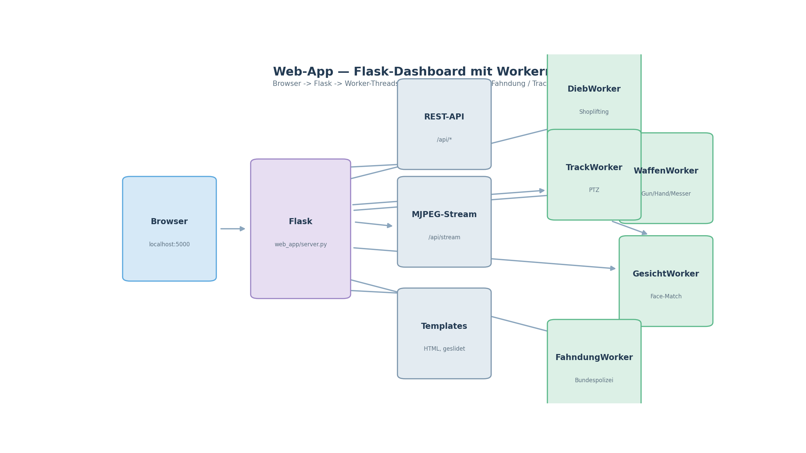

# UtutCam — Web-App (Flask Dashboard + REST-API)

## 1. Überblick

Die Web-App bündelt **alle UtutCam-Module in einem Browser-Dashboard**. Ein
Flask-Server startet parallele **Worker-Threads** für Dieb-, Waffen-,
Gesichts- und Fahndungs-Erkennung, liefert Live-Video (MJPEG) und eine
komplette REST-API zur Steuerung.

```
Browser ──► Flask (web_app/server.py) ──► Worker-Threads
                     │                        ├─ DiebWorker
   REST-API /api/*   │                        ├─ WaffenWorker
   MJPEG  /api/stream│                        ├─ GesichtWorker
                     │                        ├─ FahndungWorker
                     └────────────────────────┴─ TrackWorker (PTZ)
```



**Simulation:** [`web_app_simulation.mp4`](simulationen/web_app_simulation.mp4)
(~7 s) — Dashboard-Simulation: Worker starten nacheinander (Dieb, Waffen,
Gesicht, Fahndung, Track), das Live-Video-Fenster läuft und ein
**Waffen-Alarm** erscheint als Ereignis-Banner.

## 2. Startbefehl

```powershell
cd C:\Users\youss\Desktop\UtutCam
C:\Users\youss\AppData\Local\Python\pythoncore-3.14-64\python.exe web_app\server.py
```

Danach im Browser **`http://localhost:5000`** öffnen (der Serverlog zeigt die
genaue Adresse/Port).

## 3. Seiten

| URL-Seite | Inhalt |
|-----------|--------|
| `übersicht` | Startseite mit Status-Karten |
| `auto_track` | Personenverfolgung (PTZ) steuern/anschauen |
| `einstellungen` | Config anpassen (`data/settings.json`) |
| `Fahndung` | Fahndungsliste + Live-Match |
| `Dieb_Erkennung` | Shoplifting-Live-Ansicht |
| `Waffen_erkennung` | Gun/Hand/Messer-Live-Erkennung |
| `Gesicht_erkennung` | Face-Matching + Personen |
| `Face_manager` | Gesichtsdatenbank verwalten |
| `Person_hinzufügen_Face_manager` | Formular zum Hinzufügen |

Die HTML-Seiten kommen aus `C:\Users\youss\Desktop\UtutCam_Design` und werden
mit `web_app/prepare_pages.py` in `web_app/templates/` kopiert (inkl. der
Slider-Defaults für `auto_track.html`).

## 4. Worker (Hintergrund-Threads)

| Worker | Modul | Zweck |
|--------|-------|-------|
| `DiebWorker` | `dieb_erkennung` | erkennt Loitering/Diebstahl |
| `WaffenWorker` | `waffen_erkennung` | erkennt Waffen/Hände |
| `GesichtWorker` | `face_erkennung` | erkennt & matcht Gesichter |
| `FahndungWorker` | `fahndung` | gleicht gegen Bundespolizei-Fahndung ab |
| `TrackWorker` | `auto_track` | PTZ-Personenverfolgung |

Jeder Worker kann über die REST-API **gestartet / gestoppt** werden
(`/api/module`).

## 5. REST-API (Auszug)

| Endpoint | Methode | Beschreibung |
|----------|---------|--------------|
| `/api/config` | GET/POST | Einstellungen lesen/ändern |
| `/api/status` | GET | Status aller Worker |
| `/api/events` | GET | Event-Log (Alarme) |
| `/api/module` | POST | Modul starten/stoppen |
| `/api/fahndung` | GET | Fahndungsdaten |
| `/api/faces` | GET/POST | Gesichtsdatenbank |
| `/api/camera` | GET | Kamerastatus/Stream-Info |
| `/api/alarm` | POST | Alarm auslösen |
| `/api/ptz` | POST | PTZ steuern (left/right) |
| `/api/stream` | GET | MJPEG-Live-Stream |
| `/api/frame` | GET | Einzelbild (Screenshot) |

## 6. Einstellungen

`core/app_config.py` liefert die Standardwerte; gespeichert wird in
`data/settings.json`. `load_config()/save_config()` kümmern sich um Laden,
Zusammenführen und Sichern (bei beschädigter Datei: fallback auf Defaults).

## 7. Verwandte Dateien

- `web_app/server.py` — Flask-Server + Worker
- `web_app/prepare_pages.py` — kopiert Design-HTML in templates
- `core/app_config.py` — Config-Layer
- `docs/*.md` — Modul-Dokumentationen (Auto Track, Gesicht, Waffen, Dieb, Fahndung)